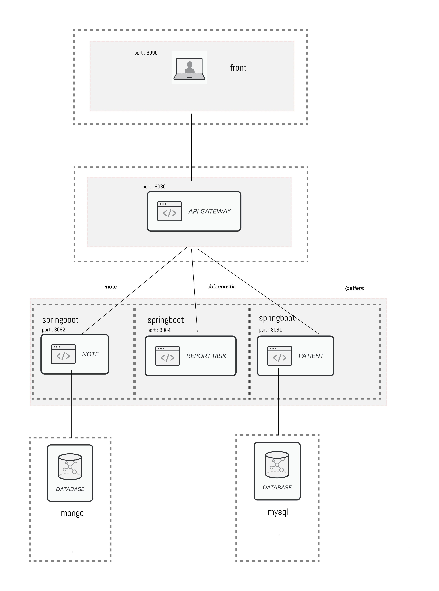

# Medilabo Project

 <!-- TOC -->
* [medilaboProject](#medilaboproject)
    * [Contexte](#contexte)
    * [Lancer l'application](#lancer-lapplication)
    * [Credentials](#credentials)
    * [Green Code](#green-code)
<!-- TOC -->

## Contexte

Le but est de développer une application sur le dépistage des risques de maladies de diabète de type 2.

Le projet est developpé suivant l'architecture microservices suivante : 

## Lancer l'application
Pour lancer l'application, veuillez lancer le docker compose qui se trouve à la racine du projet.

Puis lancer le projet à partir de cette route : http://localhost:8090/patients

## Credentials

Veuillez renseignez les informations de connexion sur la page login de l'application :

* user : user
* password : password

## Green Code
 Le green code est le fait d'appliquer des pratiques de développement durable et respectueuse de l'environnement:
* Optimisation des ressources
* Impact énergétique des serveurs, base de données.
* Code peu gourmand en ressources.

## Evolution possible (Green Code)
* Utilisation d'images légères, éviter les "latest" dans les dockerfile et priviligier des tages spécifiques.
* Utilisation des HealthChecks: aide à maintenir un service sains et éviter les ressources utilisés pour vérifier l'état des conteneurs.
* Eviter les appels inutiles ou non optimiser vers les API.
* Réduire les données redondantes en base de données.
* Mise en place d'outils de suivi de consommation de ressources.
* Optimisation de différents algorithme pour un code plus propre et optimiser.
